# Connection Flow Diagrams

Visual companion to [p2p-signaling-and-server-fallback.md](./p2p-signaling-and-server-fallback.md). All diagrams use [Mermaid](https://mermaid.js.org/) syntax and render natively on GitHub, VS Code, and most markdown viewers.

## Table of Contents

- [System Architecture](#system-architecture)
- [Transport Selection State Machine](#transport-selection-state-machine)
- [Scenario A: Same-Platform P2P (iOS ↔ iOS)](#scenario-a-same-platform-p2p-ios--ios)
- [Scenario B: Same-Platform P2P (Android ↔ Android)](#scenario-b-same-platform-p2p-android--android)
- [Scenario C: Cross-Platform Server Fallback](#scenario-c-cross-platform-server-fallback)
- [Scenario D: P2P Timeout → Server Fallback](#scenario-d-p2p-timeout--server-fallback)
- [WebRTC Handshake (Transport-Agnostic)](#webrtc-handshake-transport-agnostic)
- [Android Wi-Fi Direct Internals](#android-wi-fi-direct-internals)
- [Cleanup & Disconnect](#cleanup--disconnect)

---

## System Architecture

How the layers stack. Screens talk to `useAutoConnect`, which picks between P2P and server signaling. `useWebRTCConnection` consumes the winning channel without knowing how signals travel.

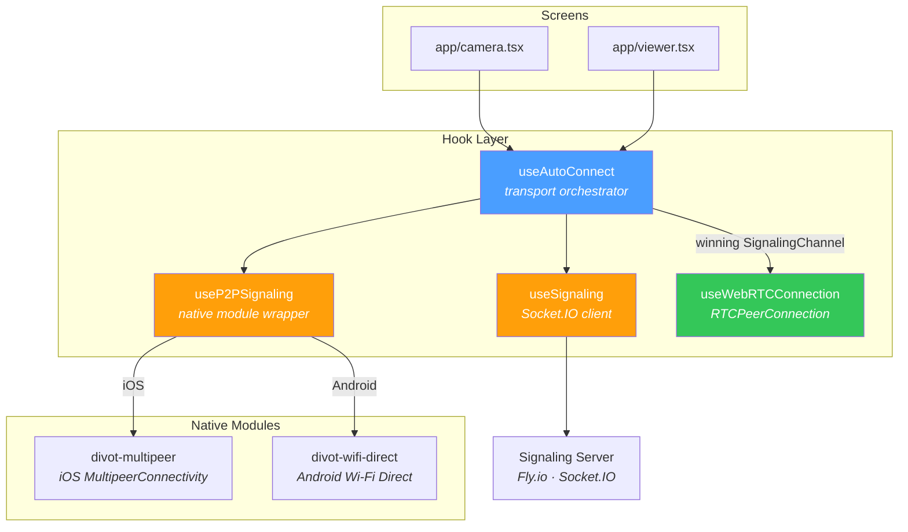

### The SignalingChannel Interface

Both `useP2PSignaling` and `useSignaling` return the same shape. `useWebRTCConnection` doesn't know or care which one it's using.

```
SignalingChannel
├── sendOffer(sdp)
├── sendAnswer(sdp)
├── sendIceCandidate(candidate)
├── onOffer(handler) → unsubscribe
├── onAnswer(handler) → unsubscribe
├── onIceCandidate(handler) → unsubscribe
└── disconnect()
```

---

## Transport Selection State Machine

`useAutoConnect` runs this state machine. Once a transport locks in, it stays for the entire session.

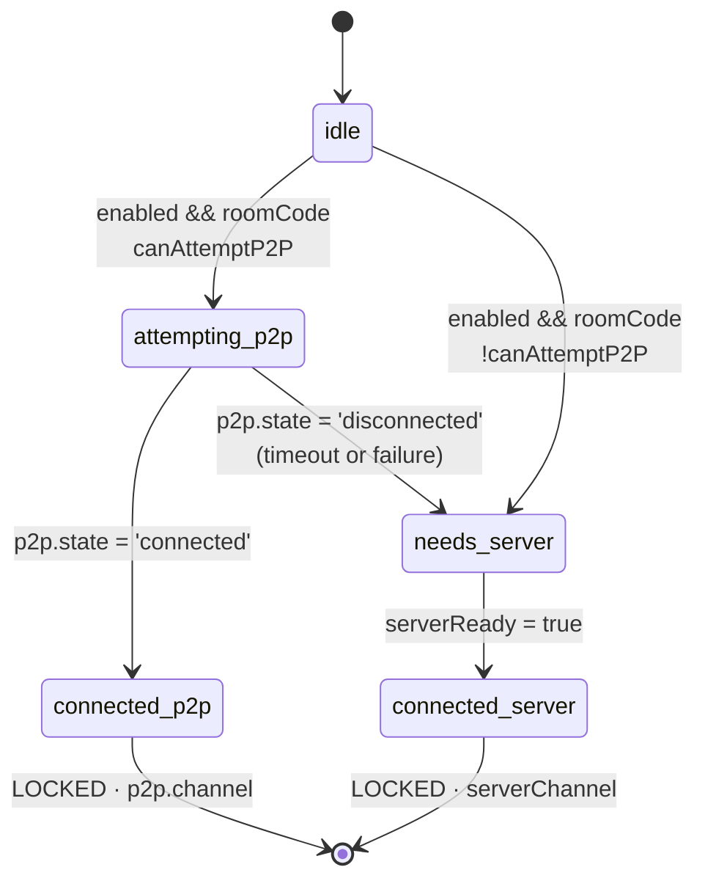

**P2P eligibility rule:**
- Camera always attempts P2P (doesn't know remote platform yet)
- Viewer attempts P2P only if `remotePlatform === localPlatform`

---

## Scenario A: Same-Platform P2P (iOS ↔ iOS)

MultipeerConnectivity handles discovery, invitation, and data transport. No server involved after QR scan.

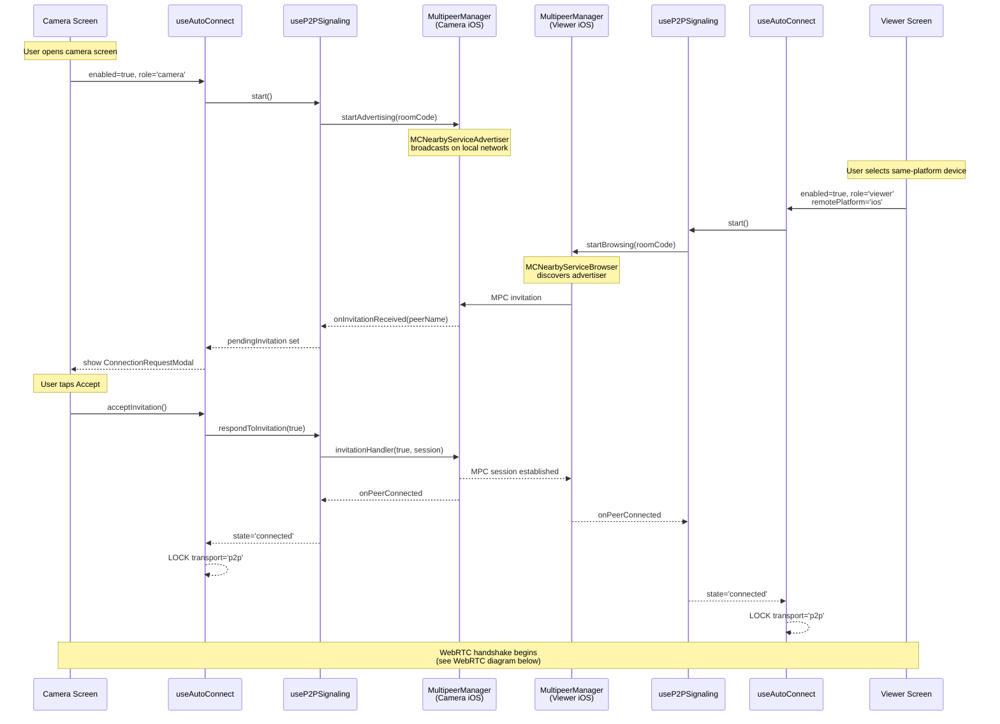

---

## Scenario B: Same-Platform P2P (Android ↔ Android)

Wi-Fi Direct uses DNS-SD discovery, a Wi-Fi Direct group, and TCP sockets for signaling. More moving parts than iOS.

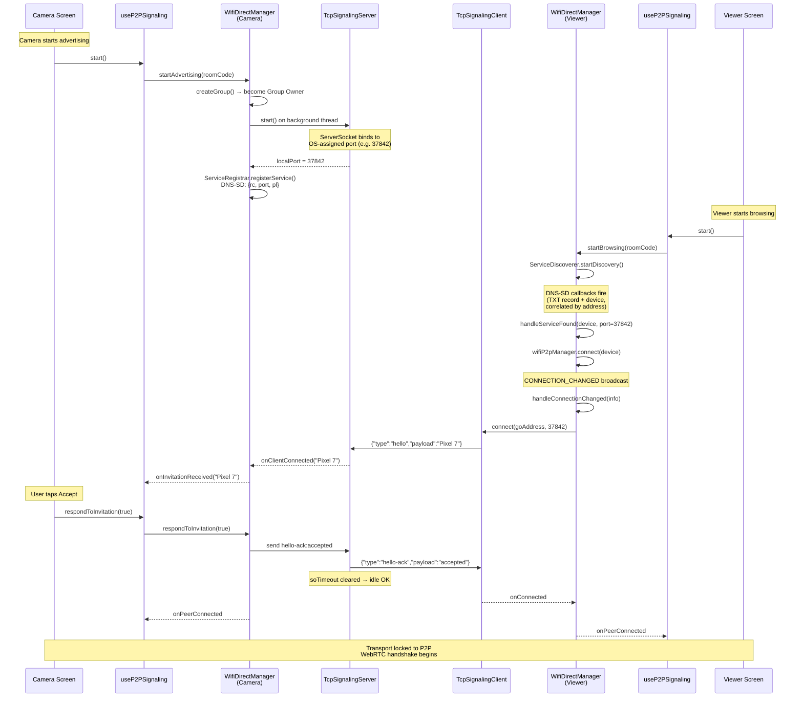

### Android DNS-SD Race Condition

Android fires two independent callbacks for each discovered service — a TXT record listener and a service response listener — in no guaranteed order. `ServiceDiscoverer` correlates them by device address:

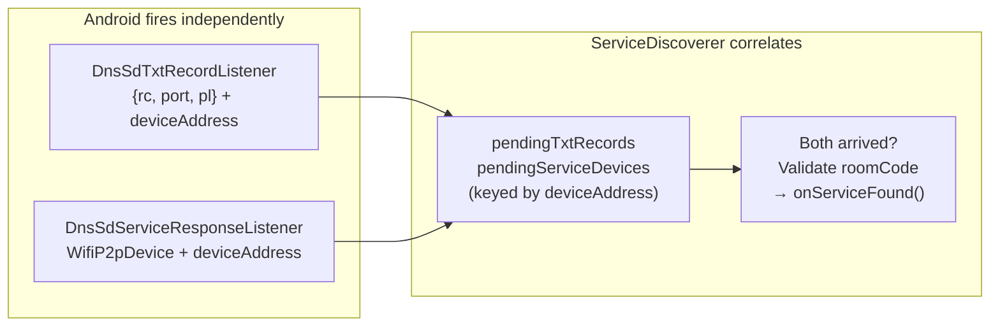

### Android CONNECTION_CHANGED vs Service Discovery Race

The viewer can receive the Wi-Fi P2P `CONNECTION_CHANGED` broadcast before service discovery provides the TCP port. This is handled with a cache:

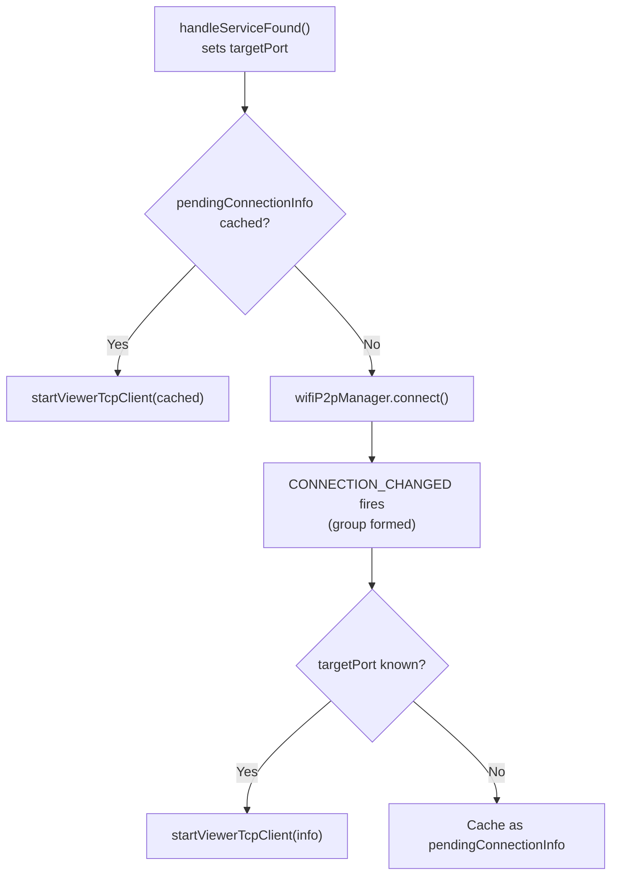

---

## Scenario C: Cross-Platform Server Fallback

When the viewer detects a different-platform camera (via BLE metadata), P2P is skipped entirely and signaling goes through the server.

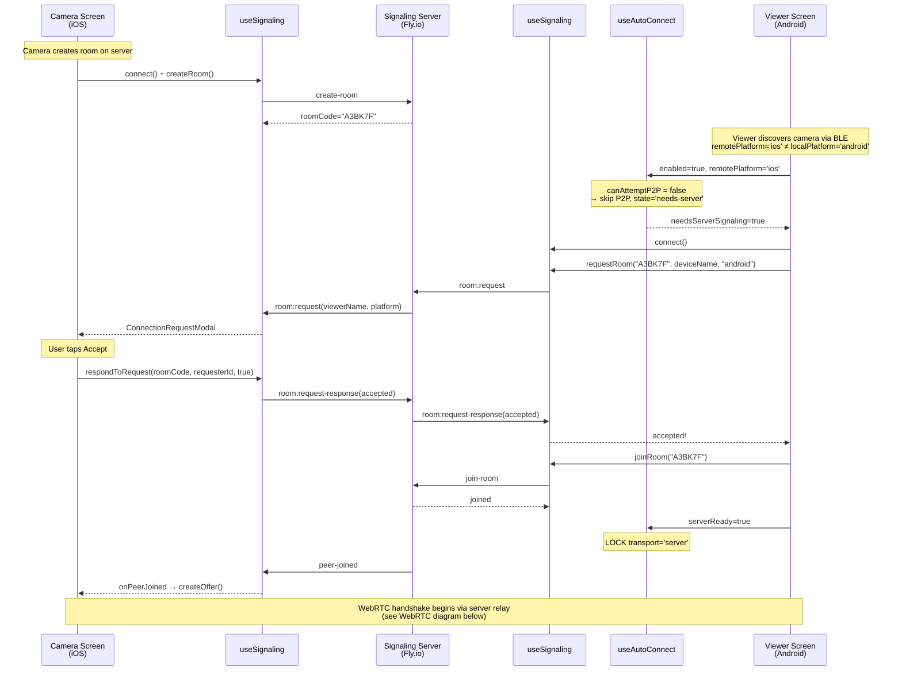

---

## Scenario D: P2P Timeout → Server Fallback

Same-platform devices, but P2P fails (Wi-Fi off, permission denied, out of range). After 25 seconds the viewer times out and falls back.

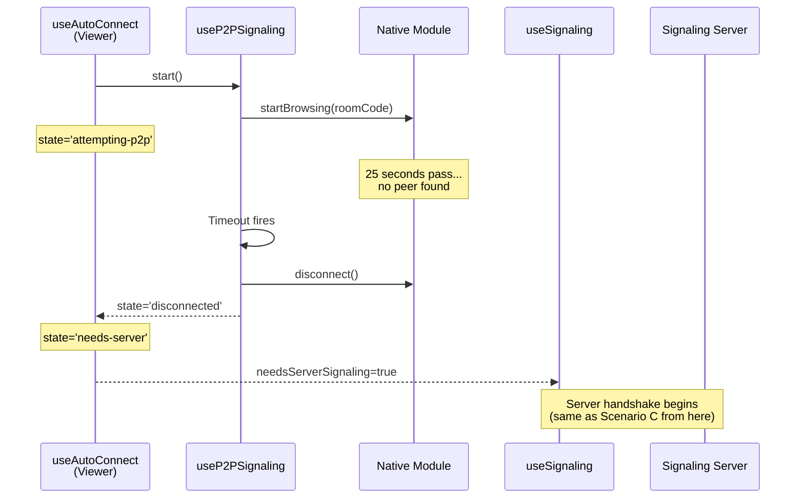

---

## WebRTC Handshake (Transport-Agnostic)

This happens identically regardless of whether signals travel over P2P or the server. `useWebRTCConnection` only sees `SignalingChannel`.

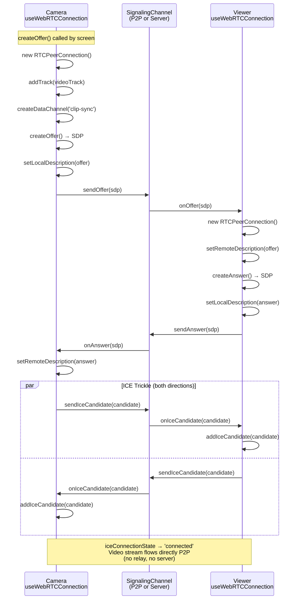

---

## Android Wi-Fi Direct Internals

Detailed component view of what happens inside `WifiDirectManager`.

### Camera Internal Flow

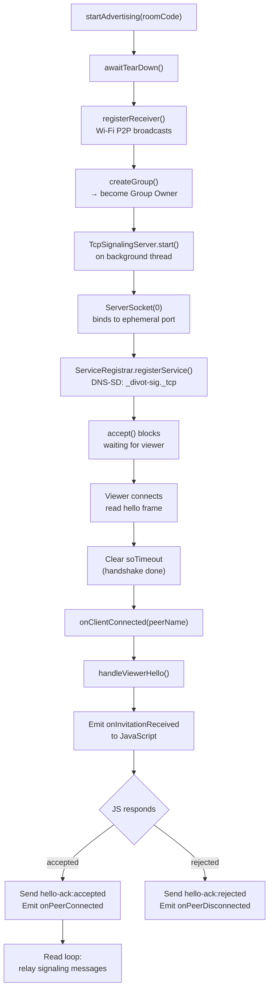

### Viewer Internal Flow

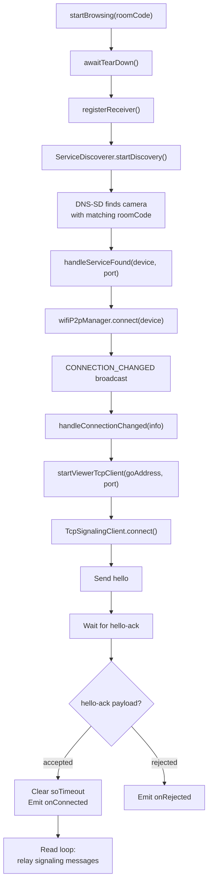

### TCP Frame Protocol

Both `TcpSignalingServer` and `TcpSignalingClient` use length-prefixed JSON frames:

```
┌─────────────────────┬──────────────────────────────────────────┐
│ 4 bytes (big-endian) │ UTF-8 JSON payload                      │
│ frame length         │                                          │
├─────────────────────┼──────────────────────────────────────────┤
│ 00 00 00 2F          │ {"type":"hello","payload":"Pixel 7"}     │
├─────────────────────┼──────────────────────────────────────────┤
│ 00 00 00 35          │ {"type":"hello-ack","payload":"accepted"} │
├─────────────────────┼──────────────────────────────────────────┤
│ 00 00 01 A4          │ {"type":"offer","payload":"v=0\r\n..."}   │
└─────────────────────┴──────────────────────────────────────────┘
```

---

## Cleanup & Disconnect

### useAutoConnect Cleanup

When `enabled` toggles false or `roomCode` changes while the component is mounted, the effect cleanup calls `p2p.stop()`. This is idempotent with `useP2PSignaling`'s own unmount cleanup.

```mermaid
graph TD
    A["enabled/roomCode changes"] --> B["useEffect cleanup fires"]
    B --> C["p2p.stop()"]
    C --> D["clearTimeout()"]
    C --> E["removeAllListeners()"]
    C --> F["nativeModule.disconnect()"]
    C --> G["state → 'disconnected'"]

    H["Component unmounts"] --> I["useP2PSignaling<br/>unmount cleanup"]
    I --> D
    I --> E
    I --> F
    Note right of I: Same calls — idempotent
```

### Android Wi-Fi P2P Disconnect Broadcast

When the Wi-Fi Direct link drops (devices out of range, OS reclaims the group), the `CONNECTION_CHANGED` broadcast handler closes TCP sockets. This unblocks read loops, whose `finally` blocks emit `onPeerDisconnected` to JS.

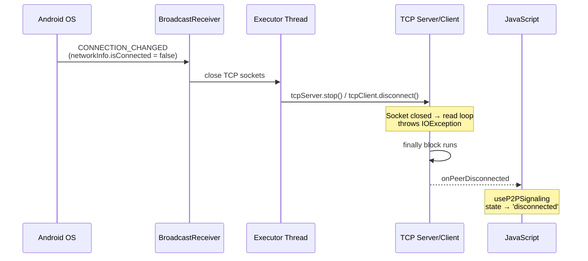

### Full Android tearDown()

Called by `disconnect()` or `awaitTearDown()` before a new session. Cleans up everything.

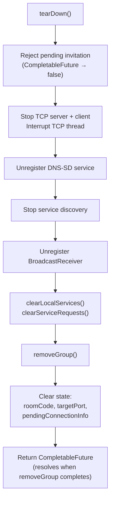
